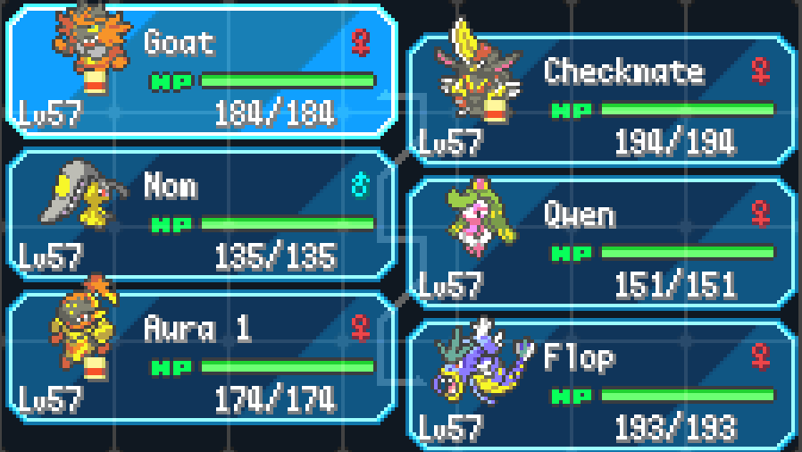

# claude-radical-red

## Overview

Pokemon Radical Red is a ROM hack of Pokemon FireRed, adding all Pokemon up to Gen 9 and incredibly difficult boss battles that require clever teambuilding and strategic play in order to win.

This project is a benchmark to see how good agents are at clearing Radical Red's boss battles.

## Benchmark Description

At the moment, we only have one boss battle: the fight against Giovanni in Silph Co. Tower, with a level cap of 57. Giovanni has a strong Rock/Ground based team, with a wide variety of secondary typings and coverage moves along with actually useful items.

The agent has access to this team:



All Pokemon are max level (57), and some have useful abilities/items. For example, Incineroar and Gyarados have Intimidate to cut the ATK stat of opposing Pokemon, Kingambit has Black Glasses to boost Dark type attacks, and Armarouge has the Weak Armor ability to potentially allow it to sweep with strategic switch-ins.

It took me ~6-8 hours to beat this battle, but a lot of that time was trying different Pokemon, items, moves, and abilities to produce a winning strategy for Giovanni. It's important to note that Giovanni's AI is *deterministic*: given the exact same setup and exact same sequence of actions in the battle, Giovanni will *always* do the same thing. The same attacks will crit/miss as well. This is an important distinction because it turns this benchmark into a search problem rather than needing to predict opponent behavior: can the agent find the winning setup/sequence of actions that leads to victory?

## Setup

### 1. Install dependencies

```bash
brew install ffmpeg cmake
uv sync
```

### 2. Build the mGBA Python bindings

The mGBA Python bindings are not on PyPI and must be built from source. A script is included that clones mGBA 0.10.5, builds the bindings, and wires them into the project venv:

```bash
bash scripts/install_mgba.sh
```

This only needs to be run once (or again after `uv sync` recreates the venv).

### 3. Add the ROM.

It's illegal to distribute the ROM itself, so you will need to find a way to obtain it and place `radicalred.gba` it in the repo root. Once you do, the committed save files should let you/an agent pick up from the Giovanni battle.


### Playing manually

To open the game in the mGBA GUI:

```bash
mgba radicalred.gba
```

mGBA picks up `radicalred.sav` automatically since it shares the same name as the ROM.

## Evaluation

Ensure you've set `LLM_API_KEY` and `LLM_BASE_URL` in your `.env` file.

Use the following command to evaluate an agent against the benchmark:

`uv run eval.py --max-attempts <m> --agent <agent_name> --model <model_name> --record`

The logs for your agent will be saved in `logs/`, and if the `--record` flag is enabled, then a video recording of the battle will also be saved.

## Next Steps

In its current state, the benchmark is quite primitive. It would be nice to actually let the agent choose its team, abilities, items, moves, EV spreads, etc., which would expand the search space significantly and make the task a lot harder. Adding more battles would be great as well. Contributions are welcome to make this happen!

