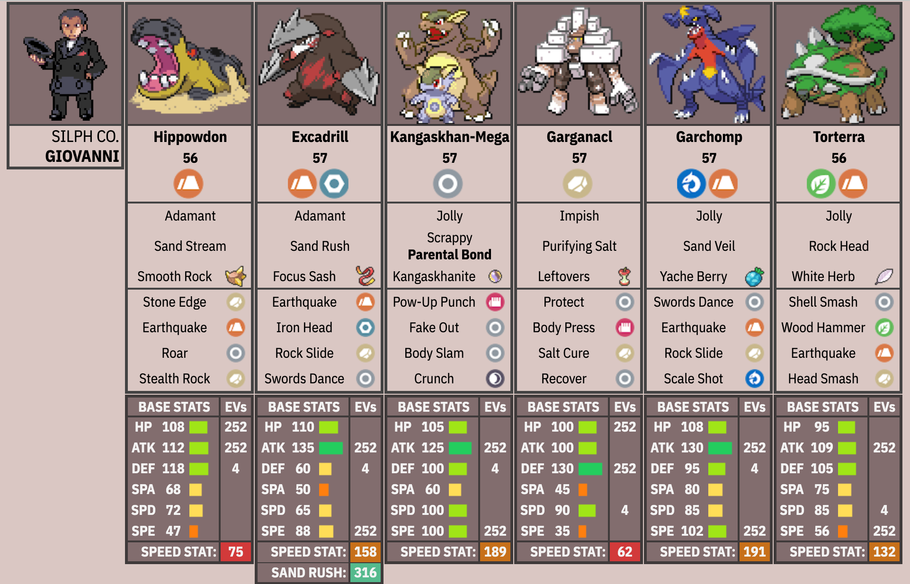

# claude-radical-red

## Overview

Pokemon Radical Red is a ROM hack of Pokemon FireRed, adding all Pokemon up to Gen 9 and incredibly difficult boss battles that require clever teambuilding and strategic play in order to win.

This project is a benchmark to see how good agents are at clearing Radical Red's boss battles.

## Benchmark Description

At the moment, we only have one boss battle: the fight against Giovanni in Silph Co. Tower, with a level cap of 57. Giovanni has a strong Rock/Ground based team, with a wide variety of secondary typings and coverage moves along with actually useful items. This is his team:



The agent has access to this team:


All Pokemon are max level (57), and some have useful abilities/items. For example, Incineroar and Gyarados have Intimidate to cut the ATK stat of opposing Pokemon, Kingambit has Black Glasses to boost Dark type attacks, and Armarouge has the Weak Armor ability to potentially allow it to sweep with strategic switch-ins.

It took me ~6-8 hours to beat this battle, but a lot of that time was trying different Pokemon, items, moves, and abilities to produce a winning strategy for Giovanni. It's important to note that Giovanni's AI is is predictable. Given the exact same game state, the enemy AI will always perform the same action. The same attacks will crit and miss, and moves will do the exact same damage. This is exploitable: for example, if you know the opponent is going to use a Dragon-type move, you can switch into a Fairy-type Pokemon to avoid taking damage.

This turns boss battles into more of a search problem: can the agent find the right setup and sequence of actions to win? Once it finds a prefix of steps in an episode that makes progress towards the goal, it can reuse that prefix across episodes and build off of it.

## Setup

### 1. Install prerequisites

Install [uv](https://docs.astral.sh/uv/) and Docker, make sure Docker is
running, then install the Python dependencies:

```bash
uv sync
```

### 2. Add the ROM

It's illegal to distribute the ROM itself, so obtain it separately and place it
at `radicalred.gba` in the repository root. The committed task fixture starts
at the Giovanni battle.

### Optional: local emulator development

Coding-agent evaluations build mGBA inside the server image, so they do not need
host-side mGBA bindings. To run emulator code directly on macOS, build the local
bindings separately:

```bash
brew install ffmpeg cmake
bash scripts/install_mgba.sh
```

To play manually, install the mGBA application and open the ROM:

```bash
mgba radicalred.gba
```

mGBA picks up `radicalred.sav` automatically since it shares the same name as the ROM.

## Evaluation

Evaluations run a coding agent in an isolated Docker sandbox. Build the trusted
server and allowlisted provider proxy once:

```bash
docker build -t rrbench-server:dev -f docker/rrbench-server.Dockerfile .
docker build -t rrbench-provider-proxy:dev -f docker/provider-proxy.Dockerfile .
docker network create --internal rrbench-egress
docker run -d --name rrbench-provider-proxy --network rrbench-egress --network-alias provider-proxy rrbench-provider-proxy:dev
docker network connect bridge rrbench-provider-proxy
```

Authenticate Codex once, then run a trial:

```bash
uv run rrbench-runner --agent codex --auth-setup \
  --credential-dir ~/.local/share/rrbench/auth/codex \
  --egress-network rrbench-egress --egress-proxy http://provider-proxy:3128

uv run rrbench-runner tasks/giovanni --agent codex --model gpt-5.6-luna \
  --max-episodes 2 --reasoning-effort low \
  --credential-dir ~/.local/share/rrbench/auth/codex \
  --egress-network rrbench-egress --egress-proxy http://provider-proxy:3128 \
  --artifacts-dir logs/codex
```

Use `--agent claude-code` with its own model and credential directory to test
Claude Code. Each retained trial contains the score, trajectory, agent event
stream, token usage, and scratch files.


## Next Steps

In its current state, the benchmark is quite primitive. It would be nice to actually let the agent choose its team, abilities, items, moves, EV spreads, etc., which would expand the search space significantly and make the task a lot harder. Adding more battles would be great as well. Contributions are welcome to make this happen!
