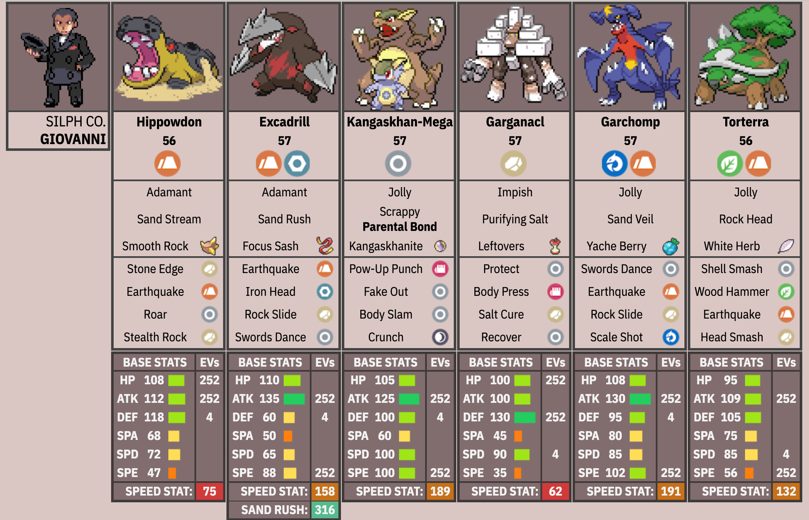
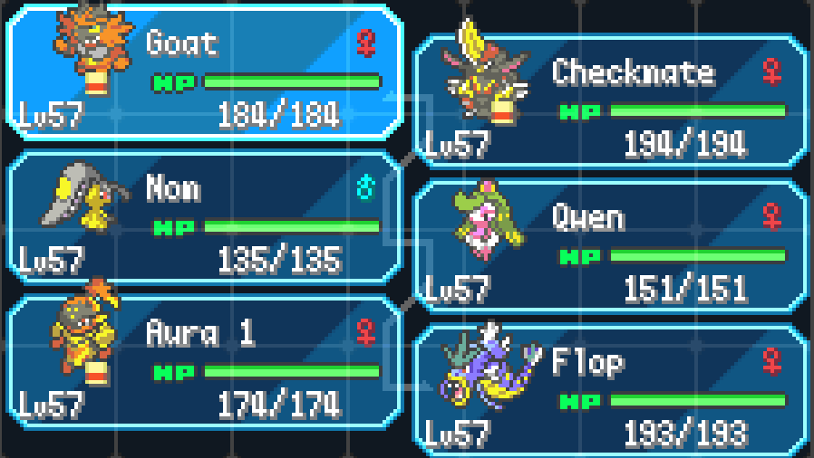

# claude-radical-red

## Overview

Pokemon Radical Red is a ROM hack of Pokemon FireRed, adding all Pokemon up to Gen 9 and incredibly difficult boss battles that require clever teambuilding and strategic play in order to win.

This project is a benchmark to see how good agents are at clearing Radical Red's boss battles.

## Benchmark Description

At the moment, we only have one boss battle: the fight against Giovanni in Silph Co. Tower, with a level cap of 57. Giovanni has a strong Rock/Ground based team, with a wide variety of secondary typings and coverage moves along with actually useful items. This is his team:



The agent has access to this team:



<details>
<summary>Winning EV spreads</summary>

| Pokemon | HP | ATK | DEF | SPE | SPA | SPDEF |
| --- | ---: | ---: | ---: | ---: | ---: | ---: |
| Incineroar | 252 | 236 | 0 | 20 | 0 | 0 |
| Kingambit | 252 | 252 | 0 | 4 | 0 | 0 |
| Mawile | 4 | 252 | 0 | 252 | 0 | 0 |
| Tsareena | 252 | 252 | 0 | 4 | 0 | 0 |
| Armarouge | 252 | 0 | 4 | 0 | 252 | 0 |
| Gyarados | 252 | 252 | 0 | 4 | 0 | 0 |

</details>

All Pokemon are max level (57), and some have useful abilities/items. For example, Incineroar and Gyarados have Intimidate to cut the ATK stat of opposing Pokemon, Kingambit has Black Glasses to boost Dark type attacks, and Armarouge has the Weak Armor ability to potentially allow it to sweep with strategic switch-ins.

It took me ~6-8 hours to beat this battle, but a lot of that time was trying different Pokemon, items, moves, and abilities to produce a winning strategy for Giovanni. I also had a suboptimal EV spread.

## Setup

### 1. Install prerequisites

Install [uv](https://docs.astral.sh/uv/) and Docker, make sure Docker is
running, then install the Python dependencies:

```bash
uv sync
```

### 2. Add the ROM

It's illegal to distribute the ROM itself, so obtain it separately and place it
at `radicalred.gba` in the repository root. The committed task fixture starts
at the Giovanni battle.

### Optional: local emulator development

Coding-agent evaluations build mGBA inside the server image, so they do not need
host-side mGBA bindings. To run emulator code directly on macOS, build the local
bindings separately:

```bash
brew install ffmpeg cmake
bash scripts/install_mgba.sh
```

To play manually, install the mGBA application and open the ROM:

```bash
mgba radicalred.gba
```

mGBA picks up `radicalred.sav` automatically since it shares the same name as the ROM.

## Tests

Run the test suite through the project’s `uv` environment:

```bash
uv run pytest -q
```

To run the fast tests without the real-ROM MCP integration test:

```bash
uv run pytest -q -m "not integration"
```

## Evaluation

Evaluations run through Harbor. Before starting a run, choose one of the
following Codex authentication methods.

To use an OpenAI API key:

```bash
export OPENAI_API_KEY="your-api-key"
```

To use a ChatGPT/Codex subscription instead, authenticate the Codex CLI and
enable Harbor's subscription-auth path:

```bash
codex login
codex login status
export CODEX_FORCE_AUTH_JSON=1
```

`CODEX_FORCE_AUTH_JSON=1` tells Harbor to use the subscription credentials in
`~/.codex/auth.json`. It is not needed when using `OPENAI_API_KEY`.

Configure the episode budget and optional recording with these environment
flags:

- `RRBENCH_MAX_EPISODES`: maximum number of episodes the battle server will
  allow. It defaults to `3`.
- `RRBENCH_RECORD`: set to `true` to record each started episode, or `false` to
  disable recording. It defaults to `false`.

For example, this runs two episodes with recording enabled:

```bash
RRBENCH_MAX_EPISODES=2 \
RRBENCH_RECORD=true \
harbor run \
  --path tasks/giovanni \
  --agent codex \
  --model gpt-5.6-luna \
  --env docker \
  --n-concurrent 1
```

Both values are passed through Harbor to the battle server, which enforces the
episode limit and performs the recording.

When the run finishes, Harbor collects one MP4 per started episode under:

```text
jobs/<job-name>/<trial-name>/artifacts/var/log/battle/videos/episode-01.mp4
```

## Next Steps

We currently support EV spread modifications by the agent. There are a whole host of other modifications we need to add (changing moves, items, abilities, natures, Pokemon, etc.). We also could use more tasks (specific boss battles in Radical Red). Contributions are welcome!
