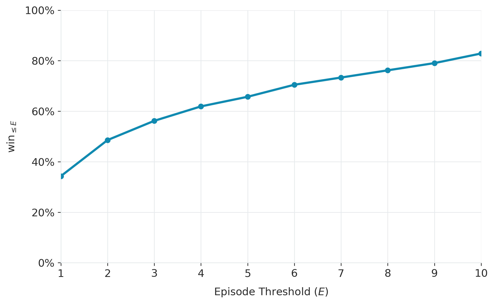
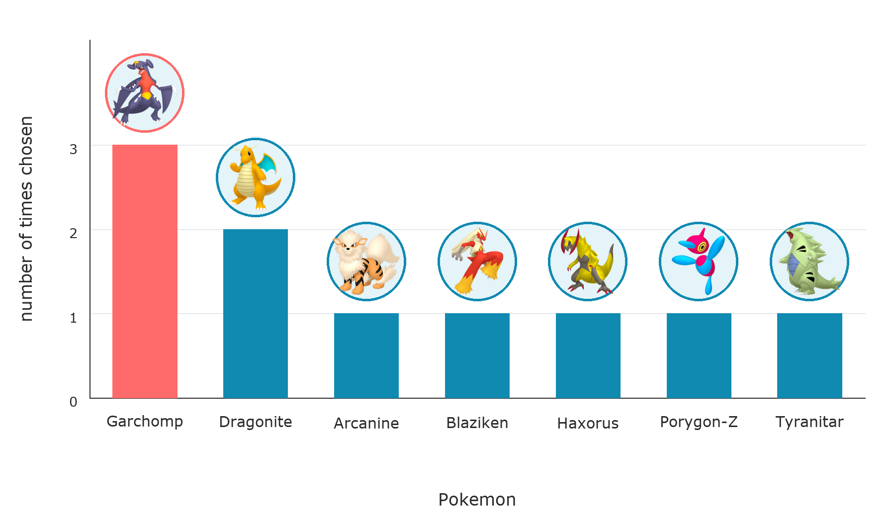

# Results

NOTE: this is still in-progress as we evaluate more coding agents

## Methodology

Evaluation is done with a max episode count of 10 and each task is repeated 5 times. When evaluating agents, we care about two things:

1. Was the agent able to complete the task within the episode budget?
2. How many episodes did it take for the agent to complete the task?

(2) matters because an agent should be efficient about its exploration and converge to a winning strategy quickly.

To combine both of these into a single metric, we'll use:

$$ \text{win}_{\leq E} = \frac{1}{E}\sum_{i}^{N} \mathbf{1}[\text{won}_i \land \{\text{episodes}_i \leq E\}]$$

which measures the fraction of trials won within $E$ episodes.

## Qualitative Evaluation

We have a special task `ghost-pokemon-tower` in which the agent battles against an Alolan-Marowak with all stats boosted, full EVs in all stats, and a custom Ability and move that make the battle extremely difficult.

It's possible to win with a full party (I used a Pokemon with Prankster + Toxic, followed by several Sucker Punch users), but what's more interesting is what happens when we lower the party size. When forced to pick just one Pokemon, which ones do coding agents lean towards? Does this vary by model? Can agents figure out a single Pokemon setup that can win against an extremely powerful opponent?

## Results by Coding Agent

### GPT-5.6 Luna (high) + Codex

#### Benchmark Results

#### Qualitative Results

For the `ghost-pokemon-tower` task, we ran 10 trials with 1 episode each to see what the agent landed on as the strongest single Pokemon setup it could use in an unknown task:

